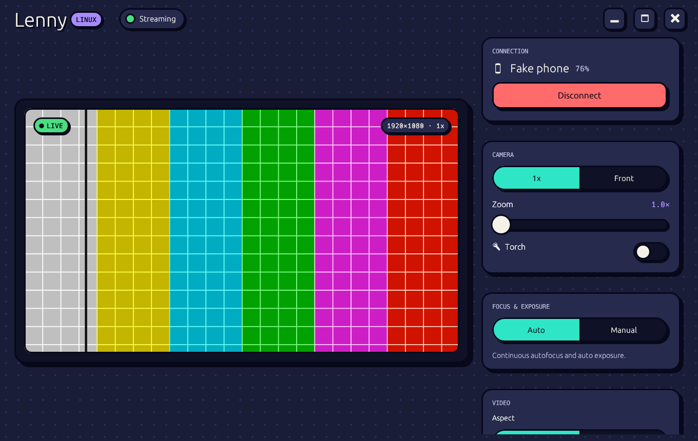

# Lenny

Use your phone as a webcam. The phone app streams its camera to the Lenny desktop app over Wi-Fi, and
the desktop app is where you pick the camera, resolution, frame rate, focus and exposure.

<p align="center">
  
</p>

<p align="center">
  
  &nbsp;
  
</p>

## Status

Early and in progress. The core is Rust now (ADR-0006) and the new desktop app is a Rust app, built and tested on
**Linux first** (ADR-0007; screenshots below, from the build sandbox with a synthetic phone). Windows moves to the
same app next; until then the Windows desktop is the Flutter one.

<p align="center">
  
</p>

What works today, on **Android → Windows** (Flutter desktop):

- Live H.264 stream over Wi-Fi, around 100 ms end to end on a home network.
- Pairing: scan the QR code on the PC, tap *Find PCs*, or type the address. Phones you allowed once reconnect without asking.
- Remote camera control from the PC: lens (0.6× / 1× / 2× / front), tap to focus, focus lock, exposure and exposure lock, torch.
- Aspect, resolution (720p / 1080p / 4K) and frame rate, switched live.
- Phone battery level on the PC, Connect / Disconnect on both sides.

Not there yet:

- **Virtual camera** for Discord, Teams, Zoom, browsers (the main goal; next milestone).
- **OBS plugin.**
- iOS phone app and Linux desktop app (designed for, not built). macOS is out of scope.
- USB connection, encryption.

## Next up

1. **Virtual camera** on Windows (plan in [architecture §7.3–7.4](docs/architecture.md)): shared-memory frame buffer + DirectShow / Media Foundation camera.
2. **OBS plugin.**
3. Desktop at the default 1600×900 window: the Exposure card scrolls and some stat values get cut off. Make it fit.
4. 60 fps (needs Camera2 high-speed session on some phones), on-phone preview, settings screen, bundle fonts offline.

Testing notes live in [docs/testing.md](docs/testing.md). The wire protocol is at 1.1 ([protocol.md](docs/protocol.md) §11).

## Try it

Grab the Android APK and the Windows zip from the [Releases](../../releases) page, when there is one. Otherwise build it:

1. Install the phone app and open Lenny Desktop on the PC. Both must be on the same Wi-Fi.
2. On the phone, tap **Scan QR** and point it at the code on the PC (or **Find PCs**).
3. The first time, allow the phone on the PC.

Windows may ask to let Lenny through the firewall: allow it on private networks, or the phone can't find the PC.

## Build

Needs Flutter (stable), Android Studio (SDK + NDK), Rust (stable) with the Android targets and cargo-ndk, and, for
Windows, Visual Studio 2022 with the C++ workload.

```sh
rustup target add aarch64-linux-android armv7-linux-androideabi x86_64-linux-android i686-linux-android
cargo install cargo-ndk
```

```sh
cd app
flutter build apk --release       # app/build/app/outputs/flutter-apk/app-release.apk
flutter build windows --release   # app/build/windows/x64/runner/Release/ (ship the whole folder)
```

Core library tests (Rust; the Android build runs cargo-ndk for you):

```sh
cargo test --workspace
core/tools/abi_check.sh   # the Rust core still exports exactly include/lenny/lenny.h (needs cbindgen, clang)
```

Linux desktop (Rust):

```sh
cargo run --release -p lenny_desktop                     # the app; falls back to a null virtual camera without v4l2loopback
sudo modprobe v4l2loopback exclusive_caps=1 card_label=Lenny   # for a real /dev/videoN other apps can open
cargo run -p lenny_desktop --example fake_phone -- 127.0.0.1 47474   # no phone at hand
```

## How it's built

| Part | What |
| --- | --- |
| `core/` | Rust library shared by every platform: protocol, sessions, pairing, clock sync. C ABI (`include/lenny/lenny.h`). |
| `vcam/` | Virtual camera behind one trait: v4l2loopback on Linux, a null (file) backend anywhere. |
| `desktop/` | Rust desktop app (egui): Linux now, Windows next. |
| `app/` | Flutter app, one codebase: phone UI on Android, desktop UI on Windows. |
| `plugins/android_camera` | Camera2 capture + MediaCodec H.264 encoder (Kotlin + JNI). |
| `plugins/windows_receiver` | Media Foundation decoder + preview texture (C++). |

More: [architecture](docs/architecture.md), [wire protocol](docs/protocol.md), [design system](docs/design.md), [testing](docs/testing.md).
